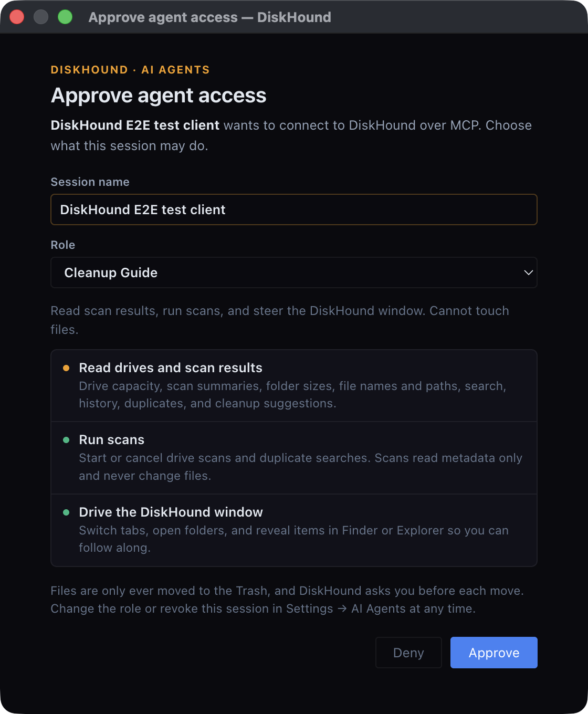
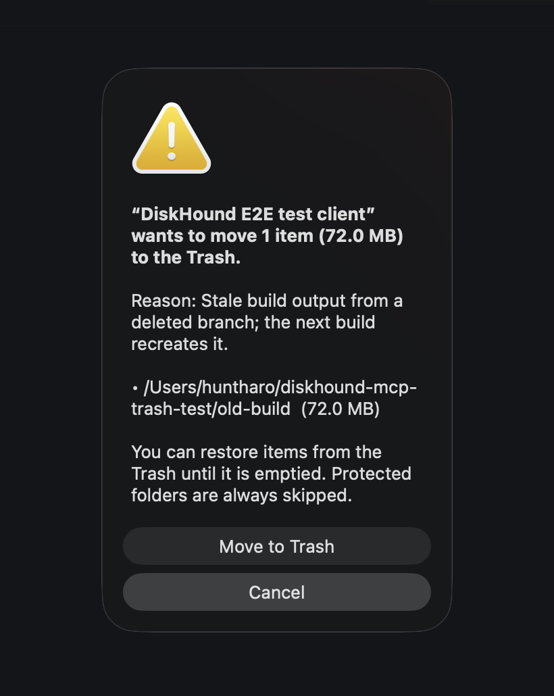

# AI agents (MCP)

DiskHound can act as a local [Model Context Protocol](https://modelcontextprotocol.io)
server, so an AI agent such as Claude Code or Codex can read your scans, run
scans, and steer the DiskHound window while it helps you free up space. The
window follows along: the agent opens folders, switches tabs, and its actions
show up in the header and in Settings.

It is off by default. Nothing listens until you turn it on, only this
computer can connect, and every agent needs your approval in DiskHound.

## Turn it on

Settings → **AI Agents** → **Allow local AI agents**. DiskHound listens on
`http://127.0.0.1:51733/mcp`. That port is fixed, so an agent's saved
configuration keeps working after restarts.

## Connect an agent

Settings shows these commands with a Copy button.

**Claude Code**

```bash
claude mcp add --scope user --transport http diskhound http://127.0.0.1:51733/mcp
claude mcp login diskhound
```

`--scope user` makes DiskHound available in every directory. Without it,
Claude Code only registers the server for the directory you ran it in.

**Codex CLI**

```bash
codex mcp add diskhound --url http://127.0.0.1:51733/mcp --oauth-client-registration dcr
```

Any MCP client that supports Streamable HTTP and OAuth works the same way.

### Approving an agent

The agent's login opens a browser tab that says **Continue in DiskHound**.
DiskHound then opens an approval window where you name the session and
pick a role. The tab can't approve anything; only the DiskHound window can.
Closing that window counts as Deny.



| Role | Can |
| --- | --- |
| Disk Explorer | Read drives, scan results, history, duplicates, and cleanup suggestions |
| Cleanup Guide (default) | Everything above, plus run scans and steer the DiskHound window |
| Cleanup Operator | Everything above, plus ask to move items to the Trash / Recycle Bin |

You can change a session's role or revoke it at any time in Settings → AI
Agents. The change applies to the agent's next call. A role can only use the
permissions the agent asked for at sign-in. Claude Code and Codex ask for all
of them, so the role you pick is what counts.

## What agents can do

| Tool | Does |
| --- | --- |
| `diskhound_status` | Drives, free space, scanned roots, running scans, what the window shows, and what this session may do. Agents start here. |
| `diskhound_scan_summary` | Totals, largest files and folders, and file types for a scan |
| `diskhound_list_folder` | One folder's children by size (the Folders tab) |
| `diskhound_search_files` | Search the full scan index by path, extension, and minimum size |
| `diskhound_cleanup_suggestions` | Temp files, caches, old downloads, and other candidates |
| `diskhound_dev_artifacts` | `node_modules`, build output, package caches, venvs, and git worktrees, grouped by project |
| `diskhound_scan_history`, `diskhound_changes` | Past scans, and what grew or shrank between two of them |
| `diskhound_duplicates`, `diskhound_find_duplicates` | Duplicate groups, and starting a duplicate search |
| `diskhound_start_scan`, `diskhound_cancel_scan` | Scan a drive or folder |
| `diskhound_show`, `diskhound_reveal_path` | Point the window at a tab, drive, or folder; reveal an item in Finder or Explorer |
| `diskhound_move_to_trash` | Ask to move up to 20 items to the Trash (Cleanup Operator only) |

Most read tools take `showInApp: true`, which moves the window to what the
agent is looking at. The header shows which agent acted last; click it to
open Settings → AI Agents, which lists recent agent actions.

**Nothing is ever deleted permanently.** `diskhound_move_to_trash` shows a
DiskHound confirmation listing every item, its size, and the agent's reason.
Nothing moves unless you click **Move to Trash**, and protected folders are
always skipped. Agents also can't move a drive root, your home folder, its
standard folders (Documents, Downloads, Desktop, Library or AppData, and so
on), DiskHound itself, or any folder that contains one of these. DiskHound
checks the real location on disk, so a different spelling or a symlink
doesn't get around this.



## Cleanup procedures (skills)

DiskHound ships two procedures that agents read before recommending anything:

- **diskhound-free-up-space**: measure the gap, get a fresh scan, walk the
  biggest folders, sweep developer caches and duplicates, and check whether
  deleting something actually frees space.
- **diskhound-investigate-growth**: compare scans to explain what filled the
  disk and when.

The free-up-space skill has one reference per OS. They cover space that
deleting files does not give back:

- **macOS**: APFS clones (for example pnpm's `node_modules`), which share
  blocks, so the space only comes back when the last copy is gone. Time
  Machine local snapshots, which keep deleted data until they expire. Purgeable
  space, and the Trash.
- **Windows**: System Restore and Volume Shadow Copies, WSL and Docker
  `.vhdx` disks that never shrink, hardlinks, and the Recycle Bin.
- **Linux**: hardlinks (pnpm stores) and reflinks, btrfs and ZFS snapshots,
  files deleted but still open, and the systemd journal.

The skills are served over MCP in two ways:

- As Skills over MCP (SEP-2640, extension `io.modelcontextprotocol/skills`):
  `skills/list`, `skills/get`, and `skill://` resources, with
  `resources/directory/read`. This is for clients that support the
  extension.
- As the prompts `free-up-space` and `investigate-growth`, for clients that
  don't. Claude Code shows these as `/mcp__diskhound__free-up-space` and
  `/mcp__diskhound__investigate-growth`.

The server's instructions also point agents at the `skill://` resources.
The source lives in [`skills/`](../skills).

## Security

- The server binds `127.0.0.1` only. It rejects any other `Host` header,
  non-loopback peers, and browser `Origin`s other than loopback. That blocks
  DNS rebinding and cross-site requests from web pages.
- OAuth 2.1 with dynamic client registration, PKCE (S256), and a resource
  indicator pinned to the MCP URL. Clients are public; there are no client
  secrets.
- Approval happens only in DiskHound's own window. Browser pages and URL
  parameters can't approve a request.
- Tokens are stored as SHA-256 hashes in `mcp-policy.json` in DiskHound's
  data folder (mode 0600). They don't expire; revoke them in Settings.
- Every tool call checks the session against the policy file, so revoking a
  session or changing its role applies immediately.
- Moving items to the Trash needs the Cleanup Operator role and your
  confirmation in a native dialog every time. If you revoke the session or
  turn AI Agents off while a request waits for its dialog, DiskHound drops
  the request.

## Troubleshooting

- **"Port 51733 is already in use"**: another program, or a second copy of
  DiskHound, holds the port. Quit it, then toggle AI Agents off and on.
- **The agent says a permission is missing**: open Settings → AI Agents and
  give that session a bigger role. The agent's next call picks it up.
- **The agent can't connect after you revoked it**: run its login again
  (`claude mcp login diskhound`, or reconnect in Codex).
