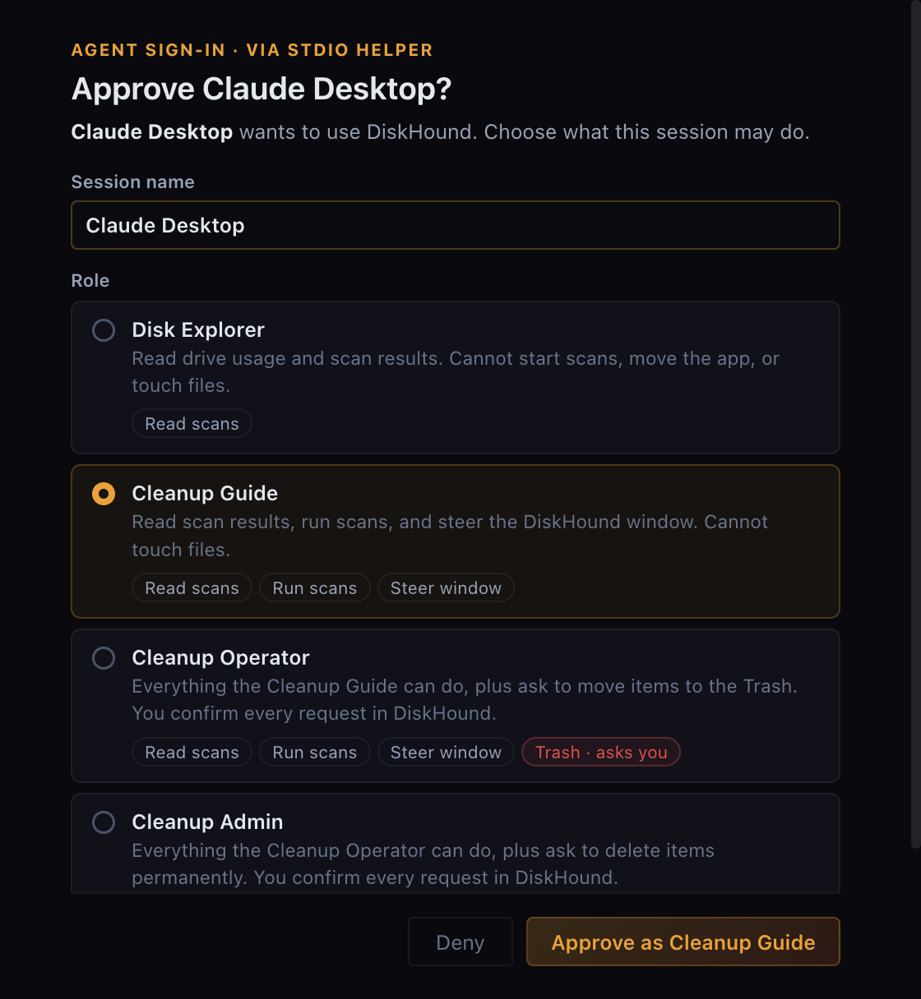
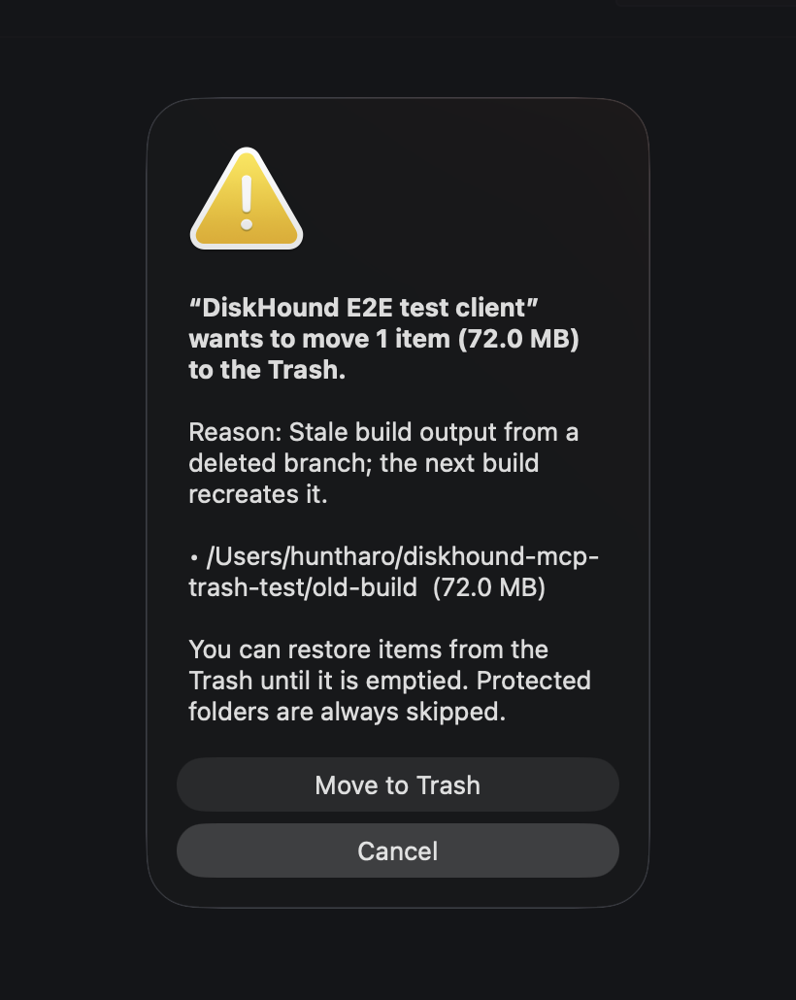

# AI agents (MCP)

DiskHound can act as a local [Model Context Protocol](https://modelcontextprotocol.io)
server, so an AI agent such as Claude Code, Claude Desktop, or Codex can read your scans, run
scans, and steer the DiskHound window while it helps you free up space. The
window follows along: the agent opens folders, switches tabs, and its actions
show up in the header and in Settings.

It is off by default. Nothing listens until you turn it on, only this
computer can connect, and every agent needs your approval in DiskHound.

## Find it

- **The header's agent button** (the small robot head, next to Settings).
  It is always there. When nothing is set up, its popover explains the
  feature and offers **Set up…**. When agents are on, a green dot shows
  DiskHound is listening, an amber badge counts sign-ins waiting for you, and
  for ten minutes after an agent acts the button becomes a pill naming it
  (blue while it works, red when a call failed or was blocked).
- **The drive picker**: *Using Claude or Codex? Connect an AI agent ›*.
- **The menus**: **Connect an AI Agent…** in the app menu, and **AI Agents…**
  in the tray menu.
- **Settings → AI Agents**, which the links above open.

## Turn it on

Settings → **AI Agents** → **Allow local AI agents**. DiskHound listens on
`http://127.0.0.1:51735/mcp`. That port is fixed, so an agent's saved
configuration keeps working after restarts.

## Connect an agent

**Connect an agent** in Settings starts with **Copy prompt for your agent**.
Paste it into Claude Code, Codex, or another agent: the agent adds DiskHound to
its own configuration and helps you approve it. DiskHound never writes another
app's configuration.

Below that is a tab for each client: Claude Code, Claude Desktop (macOS and
Windows), Codex, and other MCP clients. Each tab has that client's prompt with
a Copy button, or for Claude Desktop an **Add to Claude** button, and the
command for doing it by hand behind a **Show** button. A last step shows the
connection live: waiting, waiting for your approval (with **Review**), or
connected, with the agent's last action. It then suggests a first thing to
ask. Once an agent is connected, the guide folds away under **Connect another
agent**.

### Claude Code (stdio)

Paste the Claude Code prompt into Claude Code in your terminal or IDE. On a
Mac with DiskHound in Applications it reads:

```text
Add diskhound to my Claude Code user configuration using the stdio executable "/Applications/DiskHound.app/Contents/Resources/native/diskhound-mcp", with no arguments. Preserve my other MCP servers, then help me connect and approve access in DiskHound.
```

To do it yourself, **Show command** gives the command:

```bash
claude mcp add --scope user --transport stdio diskhound -- '/Applications/DiskHound.app/Contents/Resources/native/diskhound-mcp'
```

`--scope user` makes DiskHound available in every directory. Code sessions in
the Claude app read this configuration too, but they also get Claude
Desktop's extension, so in the Claude app use the extension and not both. If
you already registered DiskHound as HTTP,
first run `claude mcp remove --scope user diskhound`, then add it again as
stdio. Start a new session, or run `/mcp` and reconnect diskhound.

The small Rust helper translates stdio to DiskHound's loopback HTTP server and
handles OAuth itself, so you need no TLS certificate or public endpoint. It
answers the client's handshake at once and asks for your approval in the
background, so a client's connect timeout can't cut your decision short.
Until you approve, the agent sees only `diskhound_status`, which says it is
waiting; after that, the helper tells the client its tool list changed.

On Windows use the PowerShell command in Settings. The helper is in
`resources/native/diskhound-mcp.exe` beside the installed app. Linux tarball
installs also include `resources/native/diskhound-mcp`. For an **AppImage**, copy
that executable from the running image to a stable location such as
`~/.local/bin/diskhound-mcp`, then use the copied path; temporary AppImage mount
paths change between launches. Replace the copy after an app update.

### Claude Desktop (extension)

Claude Desktop's custom connectors connect from Anthropic's servers, so they
can't reach a server on your computer, and its chat can't run commands. So
DiskHound comes to Claude as an extension, an
[MCP Bundle](https://github.com/modelcontextprotocol/mcpb) that holds the
stdio helper.

Click **Add to Claude**. DiskHound builds the extension from its own helper
and opens it in Claude, which shows what it installs and asks you to confirm.
Click **Install** there; Claude doesn't need a restart. When Claude connects,
DiskHound asks you to approve **Claude Desktop**. The extension works in the
Claude app's chats and its Code sessions. To remove DiskHound, go to Claude's
Settings → Extensions.

Claude Desktop loads an extension's tools once, when it connects, and ignores
later changes to the list. So the helper holds Claude's first tool list for up
to 45 seconds while you decide, and Claude gets the tools of the role you
grant. If you take longer, or change the role later, turn DiskHound off and on
in Claude's Settings → Extensions and start a new chat; `diskhound_status`
tells the agent to ask you.

Claude passes an extension's tools on to its chats and Code sessions, but not
its resources or prompts, so agents there read DiskHound's skills with the
`diskhound_read_skill` tool.

Claude runs its own copy of the helper. After you update DiskHound, click
**Add to Claude** again so Claude's copy matches.

Claude Desktop isn't made for Linux, so DiskHound doesn't offer it there.

### Codex (HTTP with OAuth)

Paste the Codex prompt into Codex, or run the command behind **Show command**:

```bash
codex mcp add diskhound --url http://127.0.0.1:51735/mcp --oauth-client-registration dcr
```

This works for the Codex CLI and the Codex app, which share their settings.
Codex opens a browser tab that says **Continue in DiskHound**; approve the
request in DiskHound.

### Other clients

Paste the prompt into your agent. To configure a client by hand, **Show
details** gives the URL and the helper command. Clients that support OAuth over
loopback HTTP connect to the URL above. Clients that launch local servers run
the helper, with `--port <port>` if you moved DiskHound off 51735. No bearer
token belongs in client configuration. Clients that require HTTPS should use
the helper.

### Saved approvals

The helper saves each client's approval in macOS Keychain, Windows Credential
Manager, or Linux Secret Service. Later connections from the same client (say,
Claude Code), OS account and port reuse that session; another client asks for
its own. Session roles and revocation remain in DiskHound.
If a credential store is unavailable, unlock it or explicitly add `--ephemeral`
to approve every connection without saving credentials. There is no plaintext
fallback. `diskhound-mcp --forget` removes the saved connections locally; revoke
their sessions in Settings as well if you want to invalidate them.

## Approving an agent

DiskHound shows an approval sheet over its main window, naming the client
(Claude Code, Claude Desktop, Codex, or what the client calls itself) and
how it connects. You name the session and pick a role. If the sheet is
behind another app, the header button turns amber and **Review** in its
popover or in Settings brings it back. Several requests wait in line, one
sheet at a time. If the agent stops waiting (it timed out or quit), the sheet
says so and only Deny is left. Closing the sheet counts as Deny. Only
DiskHound's window can approve a request; browser pages and URL parameters
can't.



| Role | Can |
| --- | --- |
| Disk Explorer | Read drives, scan results, history, duplicates, and cleanup suggestions |
| Cleanup Guide (default) | Everything above, plus run scans and steer the DiskHound window |
| Cleanup Operator | Everything above, plus ask to move items to the Trash / Recycle Bin |
| Cleanup Admin | Everything above, plus ask to delete items permanently |

Picking more than Cleanup Guide shows what the role adds, in red for
permanent delete. **What each permission allows** lists every permission.

## Managing sessions

Settings → **AI Agents** lists each approved session: the client, how it
connects (stdio or HTTP), when you approved it, what it may do, its last
action, and how many of its requests were blocked. From there you can:

- **Change the role.** The next call uses it. The stdio helper reloads the
  agent's tool list on its own, except in Claude Desktop, which needs
  DiskHound turned off and on in its Settings → Extensions; an HTTP client
  sees new tools after it reconnects. A role can only use the permissions the agent asked for at
  sign-in. Claude Code, Claude Desktop, and Codex ask for all of them; if a
  client asked for less, Settings says so and you can revoke and reconnect it.
- **Revoke** it. Its token stops working on the next call. **Forget revoked**
  clears the list.
- See **Waiting for approval** (Review or Deny), **Blocked requests**, and
  **Recent agent actions**.

The header popover shows the same sessions, what each did last, and how many
requests were blocked today.

## What agents can do

| Tool | Does |
| --- | --- |
| `diskhound_status` | Drives, free space, scanned roots, running scans, what the window shows, and what this session may do. Agents start here. |
| `diskhound_read_skill` | DiskHound's cleanup and growth skills, for clients that can't read MCP resources |
| `diskhound_scan_summary` | Totals, largest files and folders, and file types for a scan |
| `diskhound_list_folder` | One folder's children by size (the Folders tab) |
| `diskhound_search_files` | Search the full scan index by path, extension, and minimum size |
| `diskhound_cleanup_suggestions` | Temp files, caches, old downloads, and other candidates |
| `diskhound_dev_artifacts` | `node_modules`, build output, package caches, venvs, and git worktrees, grouped by project. On APFS, what removing each tree frees, and a range for removing the listed trees together |
| `diskhound_measure_removal` | What removing a set of files and folders together frees, measured on disk now. Counts APFS clones and hardlinks once, including copies outside the set and outside any scan (macOS and Linux) |
| `diskhound_scan_history`, `diskhound_changes` | Past scans, and what grew or shrank between two of them |
| `diskhound_duplicates`, `diskhound_find_duplicates` | Duplicate groups, and starting a duplicate search |
| `diskhound_start_scan`, `diskhound_cancel_scan` | Scan a drive or folder |
| `diskhound_show`, `diskhound_reveal_path` | Point the window at a tab, drive, or folder; reveal an item in Finder or Explorer |
| `diskhound_move_to_trash` | Ask to move up to 20 items to the Trash (Cleanup Operator and Admin) |
| `diskhound_delete_permanently` | Ask to delete up to 20 items permanently (Cleanup Admin only) |

A session sees only the tools its role grants. Calling one it doesn't have
changes nothing: the agent gets an error that says which permission is
missing and where you can grant it, and DiskHound logs the attempt (see
below).

Most read tools take `showInApp: true` (for roles that may steer the window),
which moves the window to what the agent is looking at.

`diskhound_measure_removal` walks the paths it's given and reads metadata
only. It answers when the walk is done: a few seconds for a handful of
projects, a minute or two for millions of files. If the agent's client stops
waiting first (Codex waits 60 seconds by default), DiskHound finishes the
walk anyway, and the same call made again within 5 minutes gets that result
without walking again.

**You confirm every removal.** Both removal tools show a DiskHound
confirmation listing every item, its size, and the agent's reason; the
default button is Cancel. Nothing moves unless you click **Move to Trash**,
and nothing is deleted unless you click **Delete Permanently**. Protected
folders are always skipped, and so are drive roots, your home folder, its
standard folders (Documents, Downloads, Desktop, Library or AppData, and so
on), DiskHound itself, and any folder that contains one of these. The
confirmation lists what it left out and why. DiskHound checks the real
location on disk, so a different spelling or a symlink doesn't get around
this.



## Blocked requests and the security log

DiskHound records what agents tried and weren't allowed to do: a tool the
session's role doesn't grant, or a Trash or delete request that named a
protected folder. Each one shows as a red entry in the header and in
**Recent agent actions**, and a Trash or delete attempt also shows a
notification. Settings → AI Agents → **Blocked requests** lists them, with
repeats within a minute counted rather than listed again.

They are kept in `agent-security.log` in DiskHound's data folder (NDJSON,
mode 0600), so they survive restarts; **Show file** reveals it. The log only
grows when an agent is refused. It writes at most 60 lines an hour, at least
five minutes apart after the first, and rotates at 256 KB.

## Deferred tool discovery

DiskHound publishes its tools through standard `tools/list`; they can be called
without a preceding list request. Its initialization instructions describe when
to discover them: disk usage, large files, duplicates, caches, cleanup, and growth.
Hosts can keep those definitions out of the model's initial context and load
them through their own tool search. [Claude Code does this automatically](https://code.claude.com/docs/en/mcp#scale-with-mcp-tool-search).

Tool search is a client/host feature, not a required MCP server method. PwrAgent's
native tool catalog likewise adds its own `tool_search` and deferred-loading
flags; those are not advertised by its MCP adapter. DiskHound keeps its full
standard catalog available to clients without tool search, over either transport.

## Cleanup procedures (skills)

DiskHound ships two procedures that agents read before recommending anything:

- **diskhound-free-up-space**: measure the gap, get a fresh scan, walk the
  biggest folders, sweep developer caches and duplicates, and check whether
  deleting something actually frees space.
- **diskhound-investigate-growth**: compare scans to explain what filled the
  disk and when.

The free-up-space skill has one reference per OS. They cover space that
deleting files does not give back:

- **macOS**: APFS clones (for example pnpm's `node_modules`), which share
  blocks, so the space only comes back when the last copy is gone. Time
  Machine local snapshots, which keep deleted data until they expire. Purgeable
  space, and the Trash.
- **Windows**: System Restore and Volume Shadow Copies, WSL and Docker
  `.vhdx` disks that never shrink, hardlinks, and the Recycle Bin.
- **Linux**: hardlinks (pnpm stores) and reflinks, btrfs and ZFS snapshots,
  files deleted but still open, and the systemd journal.

The skills are served over MCP in two ways:

- As Skills over MCP (SEP-2640, extension `io.modelcontextprotocol/skills`):
  `skills/list`, `skills/get`, and `skill://` resources, with
  `resources/directory/read`. This is for clients that support the
  extension.
- As the prompts `free-up-space` and `investigate-growth`, for clients that
  don't. Claude Code shows these as `/mcp__diskhound__free-up-space` and
  `/mcp__diskhound__investigate-growth`.
- As the tool `diskhound_read_skill`, which returns the same text by
  `skill://` URI. Claude Desktop passes only tools on to its chats and Code
  sessions, so this is how agents there read them.

The server's instructions and `diskhound_status` also point agents at the
`skill://` URIs.
The source lives in [`skills/`](../skills).

## Security

- The server binds `127.0.0.1` only. It rejects any other `Host` header,
  non-loopback peers, and browser `Origin`s other than loopback. That blocks
  DNS rebinding and cross-site requests from web pages.
- OAuth 2.1 with dynamic client registration, PKCE (S256), and a resource
  indicator pinned to the MCP URL. Clients are public; there are no client
  secrets.
- Approval happens only in DiskHound's own window. Browser pages and URL
  parameters can't approve a request.
- Tokens are stored as SHA-256 hashes in `mcp-policy.json` in DiskHound's
  data folder (mode 0600). They don't expire; revoke them in Settings.
- Every tool call checks the session against the policy file, so revoking a
  session or changing its role applies immediately.
- Moving items to the Trash needs the Cleanup Operator or Admin role, and
  deleting permanently needs Cleanup Admin. Either needs your confirmation in
  a native dialog every time. If you revoke the session, change its role, or
  turn AI Agents off while a request waits for its dialog, DiskHound drops
  the request.
- A tool the session's role doesn't grant is left out of its tool list and
  refused before it runs, and the attempt is logged.

## Troubleshooting

- **"Port 51735 is already in use"**: another program, or a second copy of
  DiskHound, holds the port. Quit it, then toggle AI Agents off and on.
- **The agent says a permission is missing**: open Settings → AI Agents and
  give that session a bigger role. The agent's next call picks it up.
- **Claude Desktop doesn't show DiskHound**: check Claude's Settings →
  Extensions for DiskHound, and click **Add to Claude** again if it's missing.
  If **Add to Claude** says it couldn't open Claude, click **Show file** and
  open the extension with Claude. If DiskHound wasn't running with AI Agents
  on, `diskhound_status` says so. Turn it on and ask again.
- **The approval sheet says the agent stopped waiting**: Deny it and
  reconnect from the agent. With the stdio helper this rarely happens,
  because the helper keeps waiting after the client's handshake.
- **The agent can't connect after you revoked it**: the stdio helper fails the
  current connection and forgets that credential. Reconnect once more to request
  approval, or repeat the HTTP client's OAuth login. Tool calls are never retried
  automatically because their outcome may be unknown.
- **The stdio command cannot be found**: copy the command from Settings again
  after moving the app. In a source checkout, run `bun run build:mcp:debug` first.
- **Secret Service unavailable on Linux**: run in a desktop session with an
  unlocked credential store, or add `--ephemeral`. Headless sessions usually do
  not have Secret Service.

## Building the bridge

`bun run build:mcp:debug` builds the development helper; `bun run build:mcp`
builds the release binary. `bun run dist` includes it automatically. Release CI
builds both macOS architectures and combines them into the universal app.
`cargo test --locked --manifest-path native/diskhound-mcp/Cargo.toml` tests the
transport and credential lifecycle; `e2e/stdio-agent.spec.ts` tests real native
approval and MCP calls using ephemeral credentials in an isolated profile.
